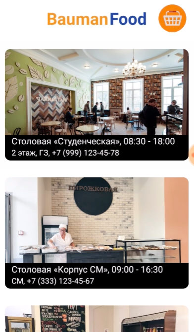
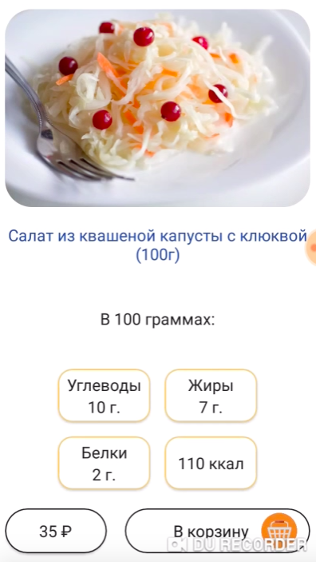
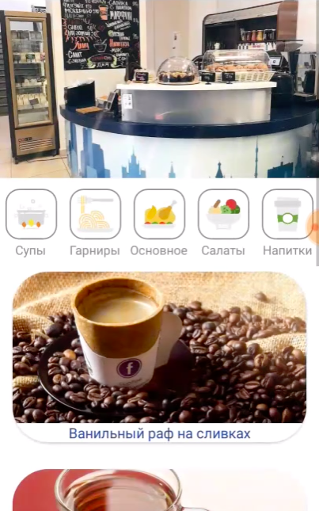

# BaumanFood

Приложение для просмотра актуального списка блюд в Бауманских столовых и кафе.

_Команда HyperCollapse_

> Чихнул

## Выполненные доп задания
1. Указаны белки, жиры и улгеводы, а так же калорийность при выборе блюд и при итоговом подсчете в "Корзине"
2. Реализация нескольких заведений. Есть возможность бесконечного расширения списка (сейчас 3).
3. При выборе заведения отображается вся необходимая информация: контакты, местоположение, режим работы. При подгрузке меню с сервера данные могут динамически формироваться в зависимости от дня. 

### Стек технологий:

| Где | Что | Зачем | Потыкать |
| :---: | --- | --- | --- |
| Android | Xamarin +  Visual Studio 2017 | Кросс платформенное приложение на выходе | [README по Android](https://github.com/RusOverLord/Xakaton/tree/master/android_bundle) |
| Сервер | PHP + Nginx | Быстро развернули на VPS | [README по Web](https://github.com/RusOverLord/Xakaton/tree/master/server_bundle) |
| БД | MySQL | Привычная база, приятные конкурсы | [Безпарольный доступ к БД](https://food.spatecon.ru/pma) |

### Демонстрация
[Видео на YouTube с комментариями](https://www.youtube.com/watch?v=RgZTaWjAAYI)

Вы также можете установить приложение на свое Android устройство с помощью собранного apk файла: [ru.spatecon.food.apk](https://github.com/RusOverLord/Xakaton/blob/master/android_bundle/ru.spatecon.food.apk?raw=true)

### От дизайнера
> Дизайн BaumanFood был разработан согласно последним трендам и тенденциям мобильной индустрии. Были выдержаны цветовые нормы, синий цвет находит отражение в символике МГТУ им. Н.Э. Баумана, в том числе и в гербе Университета, теплый оранжевый необходим для поддержания и разнообразия цветовой палитры. Прямоугольные кнопки и поля стали особенно актуальны после выхода новой версии Android9, что также нашло отражение в BaumanFood. 
  Приложение интуитивно понятно пользователю как с точки зрения UI, так и UX, простота использования позволяет мгновенно получать всю необходимую информацию.
  Был создан уникальный дизайн, который содержит элементы Flat и Material, также новый узнаваемый и легко запоминающийся логотип, который отражает суть приложения, создает определенное впечатление и настроение.
  
### От контент-мейкера
> Чтобы сделать качественное и правдоподобное приложение для университетских столовых я изучила меню каждого дня и фотографировала сами столовые. Каждое блюдо в оригинале сфоткать не получилось, но мне удалось найти очень похожие обеды в интернете. К каждому пункту в меню были просчитаны калории на конкретный вес, эта информация была взята с официальных технологических карт общепита.

МГТУ им. Н. Э. Баумана 2019