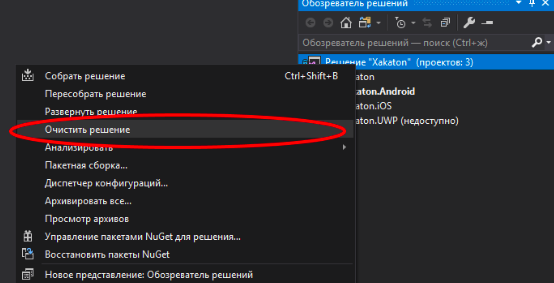
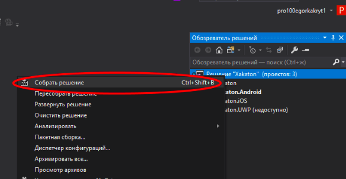
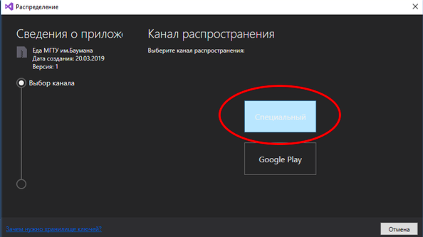

# BaumanFood (Android)

_Используется Xamarin и Visual Studio 2017 (C#)_

Системные требования к компиляции приложения:
`Windows 10, Visual Studio 2017 с установленным Xamarin`

#### Установка Xamarin:
1. Запустить Visual Studio Installer и нажать пункт "Изменить"
2. Выбрать пункт "Разработка мобильных приложений на .Net"
3. Нажать Изменить

#### Создание `.apk` файла:
1. Запустить проект Xakaton.sln
2. Установить:
    - Конфигурация решения: Release 
	- Платформы решения: Any CPU
3. Выполнить Очистку и Сборку решения (Строго в таком порядке) 

4. Выполнить архивацию Xakaton.Android
5. После архивации выбрать архив в списке и нажать на кнопку “Распространение”
6. Выбрать пункт “Специальный”

7. Если готовой подписи нет, то нажать на “+” и создать новую, иначе выбрать подпись и нажать на кнопку “Сохранить как”
8. Выбрать архив и нажать на кнопку “Открытое распространение”
9. В открывшейся папке дубет готовый `.apk`